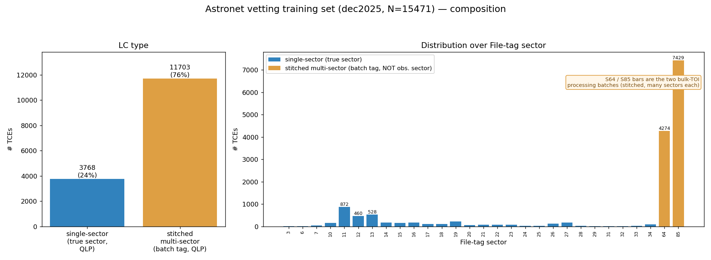

# 1. The question

We want the production Astronet **vetting** ensemble (`pablomer_final`, 10 models, trained
Mar-2026 on **QLP** light curves) to work on **TGLC** (TESS–Gaia Light Curve) photometry. The
near-term production plan is a **hybrid light curve**: keep the already-preprocessed **QLP for
old sectors**, add **TGLC for new sectors**, stitch, then phase-fold.

Two options were put on the table:

1. **Mimic the new preprocessing in our training set**, then retrain.
2. **Take the trained model and fine-tune on a few recent TGLC examples — and that's it.**

**Short answer:** neither pure option is right, but they are closer than they look. The correct
plan is **Option 1's goal (make the training distribution match what the model sees at
inference) achieved through Option 2's mechanism (warm-start *continue-training* the existing
ensemble)** — applied to a *representative* mixed-source training set rather than a handful of
examples, and staged so we are not blocked waiting on QLP. The rest of this memo explains why.

# 2. The one rule that decides everything

This codebase has already paid for the central lesson, in production
(`Astronet-Triage/DEPLOYMENT.md`, gotcha #1):

> **Train and inference preprocessing MUST match.**

When the *only* mismatch was regular- vs scatter-weighted **binning** (a far smaller change than
swapping the entire photometry pipeline), **24–31 % of top-class predictions flipped** on
sector 96, and the decision threshold had to move from 0.75 toward ~0.9 on sector 97. QLP→TGLC
changes the *photometry itself* — noise floor, systematics, detrending residuals, and, most
dangerously for vetting, **apparent transit depths and blended-EB signatures** (TGLC
decontaminates blends using Gaia).

The direct consequence: **running the QLP-trained model on TGLC unchanged is not viable.** It
will be wrong in ways that are silent and biased toward exactly the new objects we care about.
So *both* options agree we must touch training. The real debate is only about **how** and **how
much**.

# 3. The data reality (why we can't just "do Option 1 fully")

From the June-2026 status:

- Te Han has processed the **main mission + EM1 (≤ S56)** as TGLC — **but without QLP quality
  flags and without QLP detrending.** This is "raw" TGLC, *not* pipeline-consistent with how the
  model was trained.
- The **S56–S93 reprocessing through QLP** (TGLC fluxes run through QLP flags + detrending) is
  **underway but blocked**: cutouts are done; PSF and downstream steps are stuck on QLP being
  **overloaded on I/O**.
- Therefore a **uniformly pipeline-consistent TGLC training set across all sectors does not
  exist yet.** What we realistically have today is Te's raw ≤ S56.

So a faithful, from-scratch "all-TGLC" retrain (the maximalist reading of Option 1) is **not
buildable right now**. Any plan has to be robust to the QLP blockage.

# 4. What the current training set actually looks like (and a key surprise)

This shapes the decision more than anything. The labeled set behind the production model
(dec2025) is **N = 15,471 TCEs** — **Planet 5,823 · EB 3,390 · Junk 6,258**. But the headline is
*what kind of light curve each example is*:

- **~76 % of the training set (11,703 TCEs) are MULTI-SECTOR *stitched* QLP light curves** — the
  two bulk-TOI batches. Their filenames say `s0064` / `s0085`, but **that is a processing/batch
  tag, not an observation sector**: these files have a median time span of **~760 days** (many
  sectors stitched together). Only the remaining **24 % (3,768, the `mk_*` files) are genuine
  single-sector** LCs (median span ~27 d) tagged with their *true* sector S3–S34.
- **This corrects a natural assumption:** although `read_and_process_light_curve()` opens *one*
  FITS per TCE, that one FITS is usually a stitched multi-sector curve. **So the model is already
  trained, predominantly, on stitched multi-sector QLP.** The production plan to "combine QLP-old +
  TGLC-new into one light curve, then fold" is therefore the **same paradigm we already use** —
  *not* a new capability. The adaptation is simply to **swap the per-sector photometry source
  inside the existing stitch.** That is very good news: less to build, and train==inference is
  easier to preserve.
- Camera/CCD is only well-defined for the single-sector subset (a stitched LC spans several
  cam/CCDs). On those 3,768 it resolves 100 % (camera 1>2>3>4; CCD 2 most populated) — see
  `figures/training_set_camccd_singlesector.png`.
- The batch labels are also class-segregated: the **s64 batch is ≈ all Planets** (4,257 P) and the
  **s85 batch is ≈ all Junk** (6,053 J) plus most recent Planets — see
  `figures/training_set_sector_per_label.png`.

**Why this is the crux.** Because every stitched example *already* mixes many sectors, "make the
recent sectors TGLC" (constraint 3b) becomes a **per-segment source mix *within* each example** —
each example becomes a QLP+TGLC blend. That **naturally defuses** the worst confound (a whole
example being purely-one-source acting as a label proxy). What remains to watch is the *batch*-level
segregation (s64≈Planet, s85≈Junk were processed separately) when choosing which segments get TGLC.
Constraint 3a ("use the ≤ S56 TGLC") would replace the *old-sector portions* of these stitched
curves — but that TGLC is "raw" (no QLP flags/detrend), so its usability is unproven. Neither is
free — which is exactly why **Phase 0 (measure the gap) comes first.**

# 5. The two options, evaluated

## Option 2 as literally stated — "fine-tune on a few recent TGLC examples, done"
**Weakest option.**

- A handful of examples cannot close a *whole-distribution* photometric shift; it only nudges the
  decision boundary near those points.
- High **catastrophic-forgetting** risk against 15 k QLP examples.
- The recent-sector TGLC examples are themselves **class- and sector-imbalanced** (mostly recent
  TOIs), reinforcing the "source = label" confound above.
- If production feeds a **hybrid** (QLP-old + TGLC-new) curve, a model tuned only on *pure*
  recent TGLC still doesn't match the input it will see.

*But the mechanism it points at — warm-start fine-tuning rather than from-scratch — is correct.*
The vetting model already warm-starts from a frozen triage backbone, so continue-training is
natural and cheap. The flaw is "a few examples," not "fine-tune."

## Option 1 as literally stated — "mimic preprocessing, retrain"
**Right principle, currently infeasible in full.** It is the only option that respects the
train==inference rule. But (§3) we can't assemble a pipeline-consistent all-TGLC set yet, and a
full from-scratch retrain throws away the validated, hard-won ensemble behavior (and its
threshold calibration) for no added benefit over continue-training.

# 6. Recommendation — Option 1's goal via Option 2's mechanism, in three phases

> **Build the smallest training set whose *per-example source mix matches what production will
> feed the model*, then warm-start continue-train the existing ensemble on it, and recalibrate
> the threshold.** Do it in phases so Phase 0 delivers value even while QLP is blocked.

**Phase 0 — Characterize the gap before changing the model (do this now; cheap; unblocked).**
This *is* the "Pablo + David: is the ≤ S56 TGLC usable?" task, made quantitative.

- Pick targets that have **both** QLP and TGLC in the **same** sector (Te's ≤ S56 TGLC vs our
  existing QLP for the same TICs). Run the **current** model on each and measure prediction drift:
  Δdisp_p, top-class flip rate, broken down by **class, magnitude, and crowding**.
- Produce **view-level diffs** (global/local/secondary overlays, QLP vs TGLC) to see *where* TGLC
  differs — depth? scatter? secondary? odd/even?
- Reuse existing machinery: the s96/s97 comparison harness
  (`/pdo/users/pablomer/vetting_comparison_s96cam1/`, `…_s97/`) and
  `Astronet-Triage/rank_view_differences.py`.
- **Deliverable / decision:** a number for "how far is TGLC from QLP, per class," and a yes/no on
  whether raw ≤ S56 TGLC is usable *as-is* or needs QLP-equivalent flagging/detrending first.

**Phase 1 — Build a training set that matches production — *inside the existing stitch*.**

- **Keep the stitched multi-sector paradigm.** Since ~76 % of training is already stitched
  multi-sector QLP (§4), and production will also be stitched, the move is **not** to go
  single-sector (that would *break* train==inference). Instead, modify the stitcher / h5→FITS
  converter so that **chosen (recent) sectors are pulled from TGLC instead of QLP** within the same
  stitched curve — then run it through the **same** `generate_input_records_3.py` (identical
  binning + scatter weighting). Each training example becomes a QLP+TGLC blend whose source mix
  mirrors what production will feed the model.
- Keep QLP for sectors where TGLC is unavailable; the result is a **mixed-source** set with the
  production source mix baked in per example.
- **Make the TGLC inputs pipeline-consistent**: if Phase 0 shows raw TGLC's missing QLP
  flags/detrending hurt, either wait for the QLP-pipeline TGLC for those sectors, or apply our own
  flag+detrend step so TGLC enters preprocessing the same way QLP does.
- **Mind the batch-level confound** (§4): the per-segment blend already defuses the worst
  whole-example "source = label" trap, but keep the s64≈Planet / s85≈Junk batch segregation in mind
  when choosing which segments get TGLC; balance sampling if needed.

**Phase 2 — Warm-start continue-train + recalibrate.**

- Initialize from `pablomer_final` weights and continue-train at a **low learning rate** on the
  mixed-source set, **keeping QLP examples in the mix** to prevent forgetting. (This is Option 2's
  mechanism, but on a representative set — not a handful.)
- **Recalibrate the decision threshold** on validation for the new source mix. Every
  preprocessing/source change has moved the operating point (s97 evidence); TGLC will move it
  again. Recalibrate from val data, **never** from a contentious live subset.
- Validate with the standard eval (PR curves, per-class recall) **and** a fresh
  QLP-vs-TGLC behavior comparison on a held-out sector.

**Why this beats both pure options:** it closes the actual distribution gap (unlike a few-example
tune), it does not require an all-TGLC set that doesn't exist (unlike full Option 1), it preserves
the validated ensemble and is far cheaper than from-scratch, and Phase 0 produces decision-useful
results *even while QLP is blocked*.

# 7. Decision gates (what flips the plan)

| Gate | Question | If "yes / large" | If "no / small" |
|---|---|---|---|
| **G1** | Is raw ≤ S56 TGLC usable without QLP flags/detrend? (Phase 0) | use it directly for Phase 1 | add our own flag+detrend, or wait on QLP-pipeline TGLC |
| **G2** | Which sectors get TGLC inside the stitch? (production *and* training stay stitched — §4) | more TGLC segments → broader coverage, watch batch confound | recent-only TGLC → smaller, safer change |
| **G3** | Is the TGLC→QLP prediction shift large? (Phase 0) | broader TGLC coverage + per-class attention + threshold recal | a light warm-start fine-tune is enough |
| **G4** | QLP reprocessing ETA (S56–S93)? | gates pipeline-consistent new-sector TGLC | proceed on ≤ S56 now |

# 8. Risks to watch

- **EB depths via decontamination.** TGLC changes apparent depths and can erase blended-EB
  signatures → the planet-vs-EB boundary moves. **Watch EB recall specifically.**
- **Missing quality flags in raw TGLC.** Unmasked momentum-dump / scattered-light cadences →
  spurious transit-like or secondary features → false positives. Must flag before preprocessing.
- **Batch-as-label shortcut** (§4) — the s64≈Planet / s85≈Junk *processing batches* are
  class-segregated; the per-segment QLP/TGLC blend helps, but don't let "which batch got TGLC"
  become a label proxy.
- **Threshold drift** — assume the operating point moves; budget a recalibration every time the
  source mix changes.

# 9. Immediate next actions

1. **Phase 0 now** (unblocked): assemble the QLP∩TGLC same-sector overlap set; run the current
   model on both; produce drift stats + view diffs. *(Pablo + David.)*
2. **Confirm with Willie/Glen** the QLP reprocessing status + ETA (gate G4).
3. **Decide which sectors get TGLC inside the stitch** (gate G2) — recommend recent-sectors-only
   first; keep the stitched multi-sector paradigm (it already matches training, §4).
4. Only then build the mixed-source training set (Phase 1) and warm-start fine-tune (Phase 2).

*Companion material: running notes and data inventory in `TGLC_adaptation/NOTES.md`; training-set
distribution figures in `TGLC_adaptation/figures/`.*
