# Before / After TGLC — reprocessed light-curve diagnostics

For each reobserved target, the **same** reprocessed FITS (through S103) is split at the **S94 cadence boundary** into:

- **before** = sectors ≤ S93 (QLP only — drop the new TGLC data)
- **after** = everything (QLP ≤ S93 **+** TGLC ≥ S94)

Then the **real Astronet vetting preprocessing** (detrend → fold → view) is run on both. Each figure: **full light curve** (grey = before, red = added TGLC) · **local view** (transit, before vs after) · **global view** (before vs after). Generated by `diagnose_before_after.py`.

## Planets (10)

**TIC 177254988** — P = 5.921 d

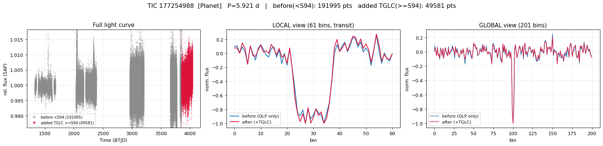

**TIC 220460087** — P = 3.271 d

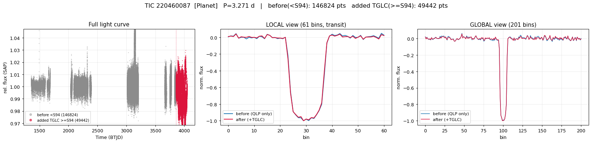

**TIC 260004324** — P = 3.814 d

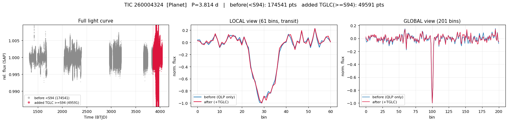

**TIC 260189643** — P = 2.054 d

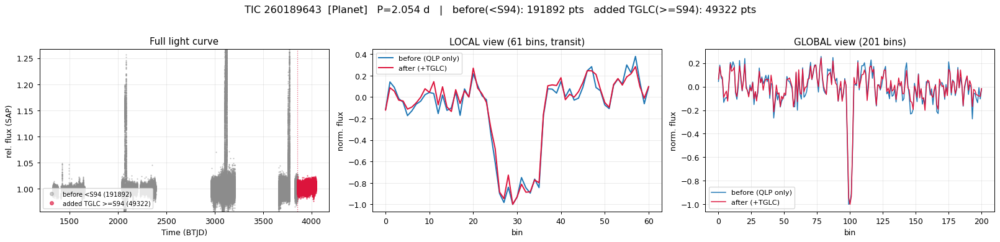

**TIC 260537454** — P = 6.319 d

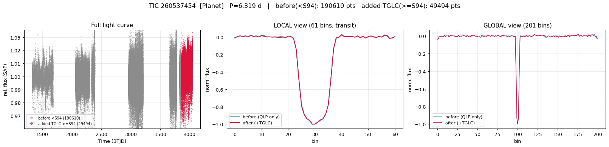

**TIC 260541432** — P = 0.872 d

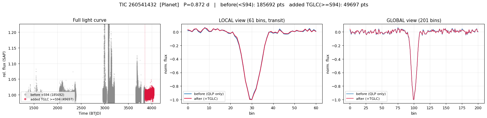

**TIC 300038935** — P = 29.050 d

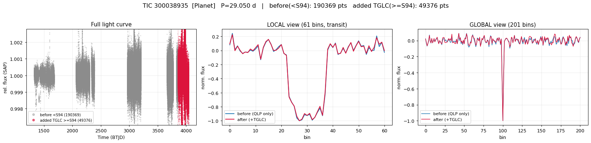

**TIC 306512967** — P = 11.184 d

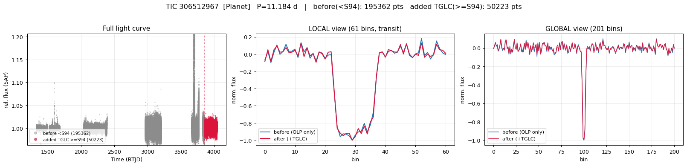

**TIC 38846515** — P = 2.849 d

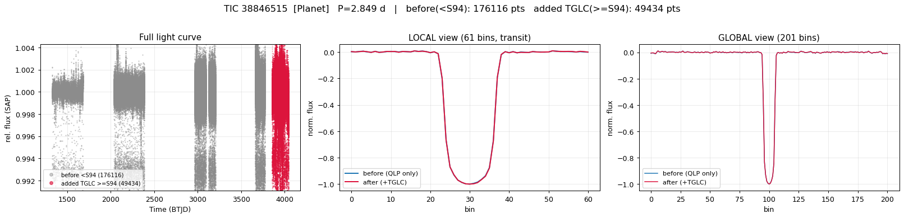

**TIC 391903064** — P = 4.666 d

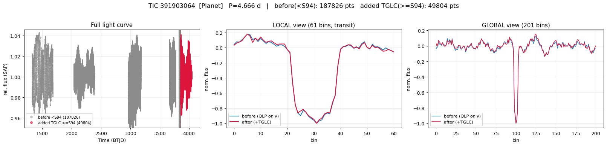

## Eclipsing binaries (10)

**TIC 140892243** — P = 1.687 d

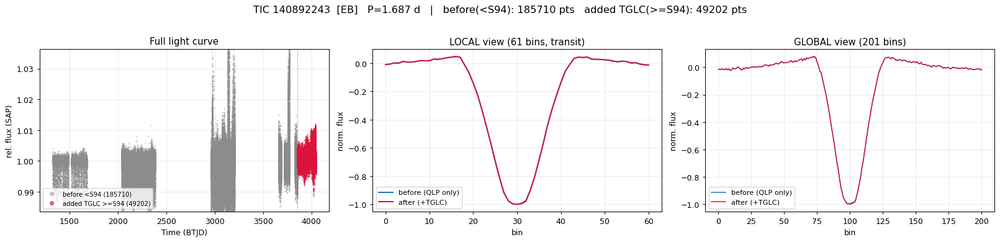

**TIC 141685465** — P = 7.808 d

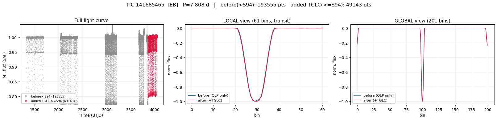

**TIC 141809360** — P = 12.158 d

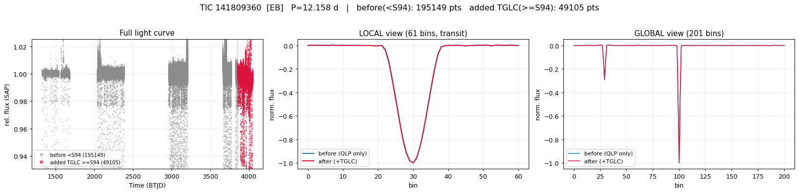

**TIC 167812449** — P = 4.236 d

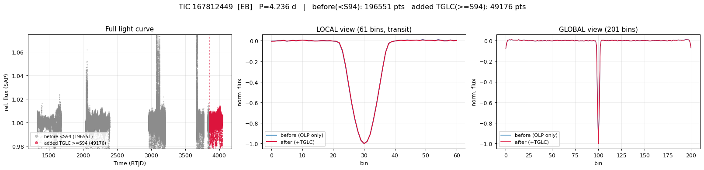

**TIC 177077475** — P = 23.426 d

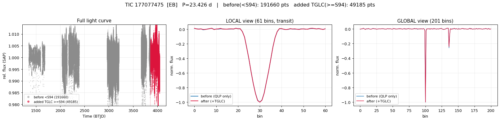

**TIC 177239203** — P = 18.985 d

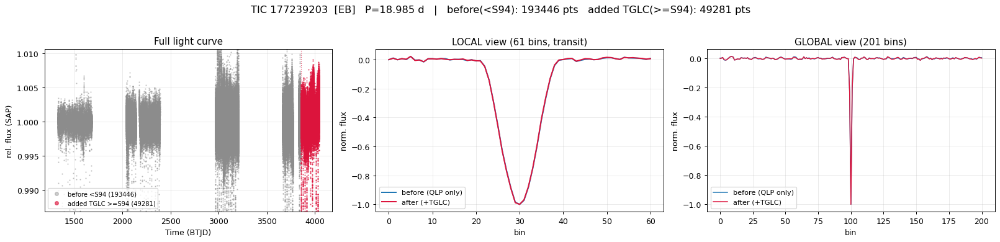

**TIC 220474209** — P = 1.960 d

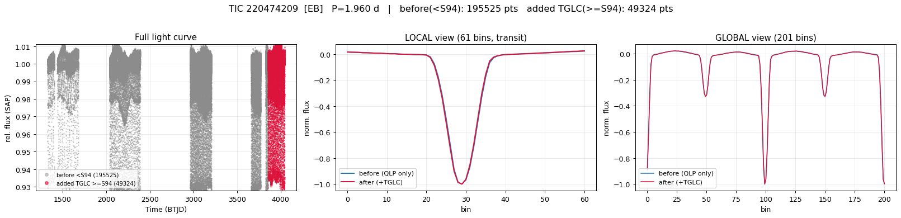

**TIC 277027632** — P = 1.613 d

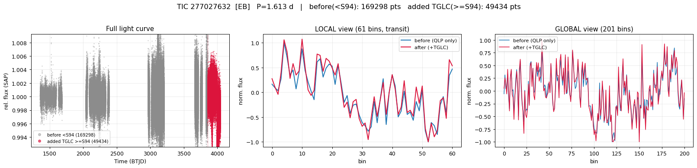

**TIC 300086757** — P = 7.543 d

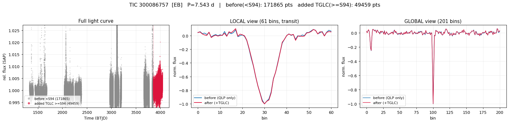

**TIC 364302118** — P = 0.673 d

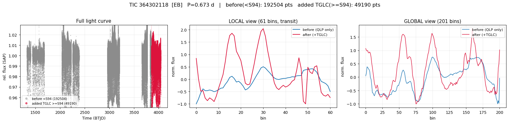

## Junk (10)

**TIC 139371718** — P = 2.780 d

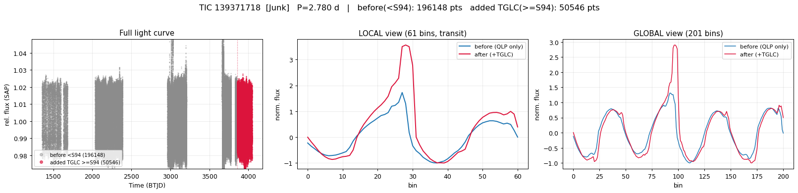

**TIC 150430481** — P = 3.183 d

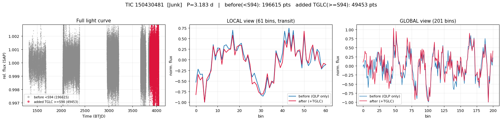

**TIC 167554509** — P = 0.603 d

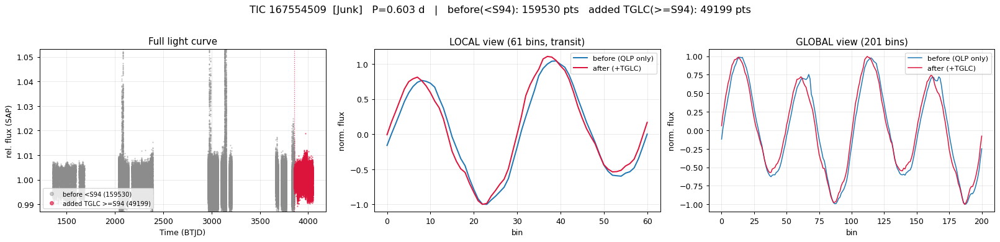

**TIC 294205251** — P = 1.075 d

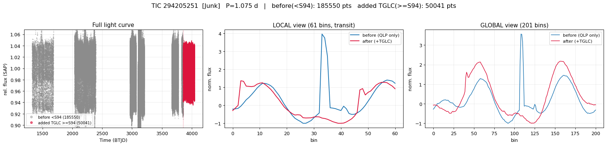

**TIC 32072326** — P = 20.145 d

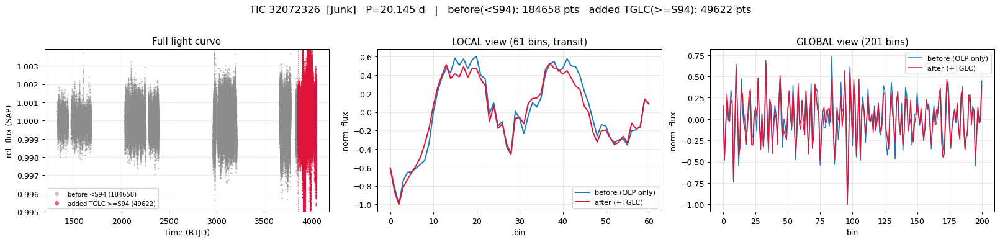

**TIC 348842421** — P = 1.466 d

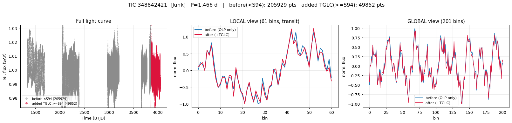

**TIC 349155856** — P = 0.565 d

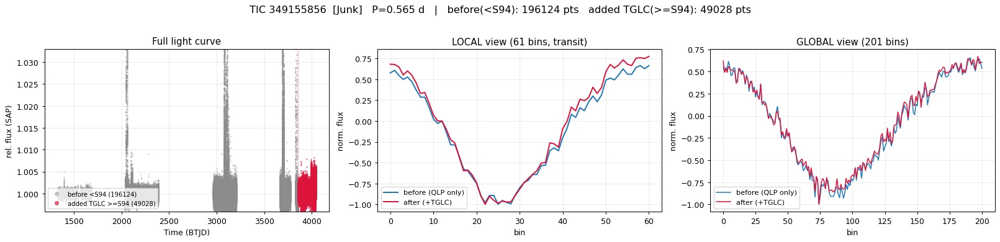

**TIC 349681583** — P = 1.217 d

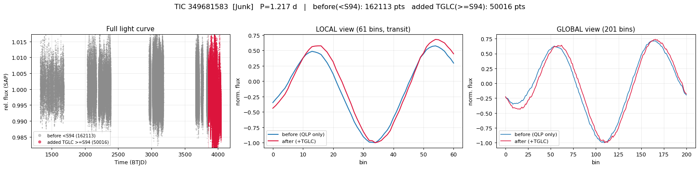

**TIC 38680567** — P = 1.410 d

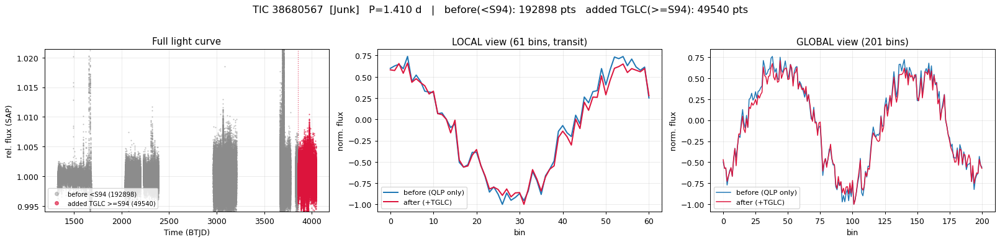

**TIC 38824632** — P = 3.981 d

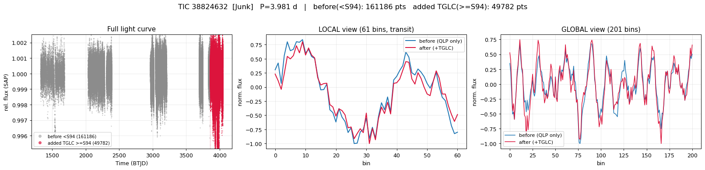
